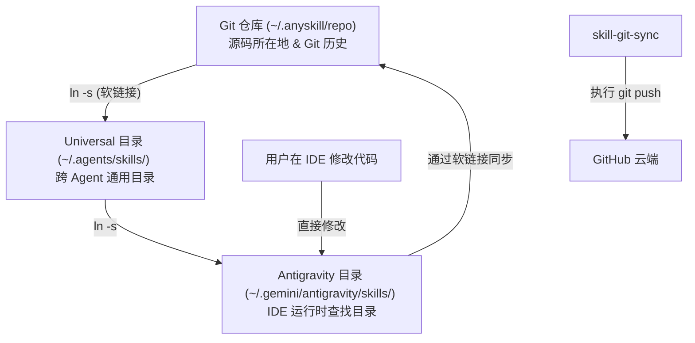

# /skill-git-sync — 技能仓库同步专家

此技能专门用于管理 Agent 技能的本地开发与云端同步。它能帮您理清不同目录间的联动关系，并一键完成 Git 提交。

## 目录关系图解 (Architecture)



> [!NOTE]
> 这种“三位一体”的结构确保了您在 IDE 中的任何改动都会直接反映在源码仓库中，方便随时提交。

## 常用指令

### 1. 检查所有技能的 Git 状态
```bash
python3 ~/.agents/skills/skill-git-sync/scripts/sync_helper.py status
```

### 2. 同步特定技能到云端
```bash
python3 ~/.agents/skills/skill-git-sync/scripts/sync_helper.py push <skill-name> -m "您的提交说明"
```
例如：
```bash
python3 ~/.agents/skills/skill-git-sync/scripts/sync_helper.py push skill-manager-skill -m "fix: 优化了路径识别逻辑"
```

### 3. 一键同步所有改动
```bash
python3 ~/.agents/skills/skill-git-sync/scripts/sync_helper.py push --all -m "chore: 批量更新技能"
```

## 功能特性
- **自动识别**: 自动寻找技能对应的真实 Git 仓库位置。
- **安全检查**: 在提交前确认目录是否为 Git 仓库。
- **防止冗余**: 默认忽略编译缓存和临时文件。
